# Note de comparaison — Évolution du prédicteur de séjour prolongé

> **Décision en une phrase** : retenir l'option A comme cible immédiate et n'activer l'option B que si une comparaison contrôlée démontre un gain prédictif utile des variables extraites, sans dépasser les budgets de coût, de latence et de conformité, ne pas retenir C pour une prédiction tabulaire mono-étape.

## Synthèse (3 min)

Les trois options conservent un modèle ML et une validation humaine avant toute
action patient. A modernise le prédicteur tabulaire avec une chaîne versionnée,
calibrée et explicable. B ajoute un LLM uniquement pour extraire des variables
des comptes-rendus sous schéma contrôlé, puis laisse le ML prédire. C orchestre
plusieurs agents et réserve le LLM à la mise en forme de l'explication.

À l'hypothèse de 5 000 séjours par jour, soit environ 150 000 décisions par
mois, A coûte environ **50 €/mois**. B coûte environ **125 / 420 / 1 150 € par
mois** selon le palier LLM, avant relecture humaine. C coûte environ **200 à
950 €/mois**. Ces montants sont des ordres de grandeur, pas des mesures de
production, et la relecture humaine peut représenter environ **4 000 €/mois**
si 5 % des dossiers sont relus.

## 3 options détaillées

### A — ML classique modernisé

Le pipeline de données, les features, le jeu de test, le modèle et le seuil
sont versionnés. La régression logistique calibrée reste la baseline. Les
contrôles portent sur les entrées, la confiance, la dérive et les écarts par
groupe. La cible initiale est un p95 inférieur ou égal à 200 ms, avec un coût
d'environ 50 €/mois. La limite principale est l'information absente des
variables tabulaires et la dépendance à la qualité de `sejour_prolonge`.

```mermaid
flowchart LR
    A[Sources MediVox] --> B[Contrat de données<br/>validation + minimisation]
    B --> C[Pipeline de features versionné<br/>encodage + imputation]
    C --> D[Jeu train/test figé<br/>split temporel + groupes]
    D --> E[Entraînement ML classique<br/>régression logistique calibrée]
    E --> F[Évaluation<br/>ROC-AUC + calibration + FNR/FPR]
    F --> G{Revue indépendante<br/>seuil et biais acceptables ?}
    G -->|Oui| H[Registre modèles<br/>artefact + métadonnées]
    G -->|Non| R[Rejet / retour aux données<br/>et à l'étiquetage]
    H --> I[CI/CD contrôlé<br/>tests + scan dépendances<br/>déploiement réversible]
    I --> S[Service sécurisé<br/>API versionnée + IAM<br/>chiffrement + secrets protégés]
    S --> T[Service de prédiction<br/>contrat d'API]
    T --> J{Contrôles<br/>entrée + dérive + confiance}
    J -->|Conforme| K[Score + explication<br/>et recommandation de revue]
    J -->|Invalide / incertain| L[Abstention<br/>revue humaine]
    K --> M[Validation humaine<br/>avant action patient]
    L --> M
    M --> N[Décision métier<br/>et journal d'audit]
    N --> O[Monitoring<br/>performance + équité + incidents]
    O -. réentraînement contrôlé .-> D

    classDef data fill:#e8f1fb,stroke:#2563eb,color:#111827;
    classDef process fill:#ecfdf5,stroke:#059669,color:#111827;
    classDef control fill:#fff7ed,stroke:#ea580c,color:#111827;
    classDef risk fill:#fef2f2,stroke:#dc2626,color:#111827;
    class A,B,D data;
    class C,E,F,H,I,S,T,K,M,N,O process;
    class G,J control;
    class R,L risk;
```

### B — Hybride LLM vers ML

Le LLM extrait des variables autorisées dans un schéma JSON et le validateur
contrôle types, bornes, `null`, provenance et incertitude. Une relecture humaine
est requise si l'extraction est douteuse. Chaque variable conserve sa citation
source et la décision reste portée par le modèle ML explicable.

L'apport est mesuré par comparaison contrôlée : même modèle ML, même jeu de
test, mêmes métriques, variables historiques seules contre variables
historiques enrichies. La cible initiale est un p95 d'extraction inférieur ou
égal à 3 s par document, avec un coût de 125 à 1 150 €/mois selon le modèle.
Le risque principal est une extraction fausse ou incomplète, malgré un JSON
valide.

```mermaid
flowchart LR
        A[Sources MediVox<br/>comptes-rendus] --> B[Contrat d'entrée<br/>minimisation + contrôle accès]
        B --> C[LLM d'extraction<br/>prompt versionné + schéma JSON]
        C --> D[Validation structurée<br/>types + bornes + champs requis]
        D --> E{Confiance et cohérence<br/>acceptables ?}
        E -->|Non| R[Relecture humaine<br/>ou abstention extraction]
        E -->|Oui| F[Variables extraites<br/>avec provenance + incertitude]
        F --> G[Enrichissement du pipeline ML<br/>features texte + tabulaires]
        G --> H[Jeu train/test figé<br/>ablation + split temporel/groupes]
        H --> I[Entraînement ML<br/>régression logistique calibrée]
        I --> J[Évaluation<br/>F1 + calibration + FNR/FPR]
        J --> K{Revue indépendante<br/>gain prouvé et biais acceptables ?}
        K -->|Non| X[Rejet / retour<br/>au prompt ou aux données]
        K -->|Oui| L[Registre<br/>LLM + prompt + ML + dataset]
        L --> M[CI/CD contrôlé<br/>tests + scans + rollback]
        M --> N[Service sécurisé<br/>API + IAM + secrets protégés]
        N --> O[Extraction LLM puis prédiction ML<br/>contrats versionnés]
        O --> P{Contrôles<br/>entrée + extraction + dérive}
        P -->|Conforme| Q[Score + variables citées<br/>recommandation de revue]
        P -->|Invalide / incertain| R
        Q --> S[Validation humaine<br/>avant action patient]
        R --> S
        S --> T[Décision métier<br/>et journal d'audit]
        T --> U[Monitoring<br/>qualité extraction + ML + coûts]
        U -. réentraînement contrôlé .-> H

        classDef data fill:#e8f1fb,stroke:#2563eb,color:#111827;
        classDef process fill:#ecfdf5,stroke:#059669,color:#111827;
        classDef control fill:#fff7ed,stroke:#ea580c,color:#111827;
        classDef risk fill:#fef2f2,stroke:#dc2626,color:#111827;
        class A,B,F,H data;
        class C,G,I,J,L,M,N,O,Q,S,T,U process;
        class D,E,K,P control;
        class R,X risk;
```

### C — Multi-agents orchestrés

LangGraph coordonne validation, prédiction, explication et supervision dans un
état partagé versionné. Les transitions, reprises, tokens et délais sont
bornés. C apporte une modularité utile pour un flux réellement multi-étapes,
mais pas de gain démontré pour une prédiction tabulaire mono-étape. Elle coûte
environ 200 à 950 €/mois et ajoute latence, observabilité, dépendance LLM et
complexité opérationnelle.

```mermaid
flowchart LR
    A[Sources MediVox] --> B[Contrat de données<br/>validation + minimisation]
    B --> C[Orchestrateur LangGraph<br/>graphe d'états + budgets]
    I[CI/CD contrôlé<br/>tests par agent + scan<br/>déploiement réversible] --> S[Service sécurisé<br/>API versionnée + IAM<br/>chiffrement + secrets]
    S --> C
    C --> P{Garde-fous d'orchestration<br/>≤ 8 transitions, 1 reprise max<br/>timeout 5 s + budget tokens}
    P -. dépassement / boucle détectée .-> L
    P --> D[État partagé versionné<br/>entrée, prédiction, explication, confiance, compteur]
    D --> E[Agent Validation<br/>schéma + RGPD + minimisation]
    E --> J{Contrôles<br/>entrée + dérive}
    J -->|Invalide| R[Rejet<br/>retour données / étiquetage]
    J -->|Conforme| F[Agent Prédicteur<br/>modèle tabulaire, sans LLM]
    F --> H[Agent Explication<br/>facteurs + incertitude]
    H --> U{Filtre anti-injection<br/>instruction ≠ donnée<br/>champs en liste blanche}
    U -->|Motif suspect| V[Quarantaine + alerte<br/>explication factuelle sans LLM]
    U -->|Sain| T[Passerelle LLM<br/>sans outil ni accès données<br/>sortie JSON validée + quota]
    T --> G{Agent Superviseur<br/>confiance + cohérence ≥ seuil ?}
    V --> G
    G -->|Oui| K[Score + explication<br/>tracés par agent]
    G -->|Non / budget dépassé| L[Abstention<br/>escalade humaine]
    K --> M[Validation humaine habilitée<br/>avant action patient]
    L --> M
    M --> N[Décision métier<br/>journal d'audit par étape]
    N --> O[Monitoring<br/>latence, coût, boucles, dérive, équité]
    O -. réglage seuils / réentraînement .-> D

    classDef data fill:#e8f1fb,stroke:#2563eb,color:#111827;
    classDef process fill:#ecfdf5,stroke:#059669,color:#111827;
    classDef control fill:#fff7ed,stroke:#ea580c,color:#111827;
    classDef risk fill:#fef2f2,stroke:#dc2626,color:#111827;
    class A,B,D data;
    class C,E,F,H,I,S,T,K,M,N,O process;
    class G,J,P,U control;
    class R,L,V risk;
```

## Comparatif

Le tableau détaillé et les hypothèses chiffrées figurent dans
[`comparatif.md`](comparatif.md). Les niveaux de conformité et d'évolutivité
sont qualifiés, tandis que performance et sobriété sont chiffrées par ordres de
grandeur. Aucune performance prédictive n'est présentée comme acquise avant
mesure sur un jeu de test indépendant.

## Fallback strategies

Le fallback est une règle de conception déclenchée au moment du traitement :

| Option | Déclencheur et risque | Fallback et obligation |
|---|---|---|
| A | Entrée invalide, hors distribution, confiance insuffisante ou service indisponible ; risque de fausse recommandation. | Abstention, revue par un professionnel habilité, possibilité de modifier ou contredire le score, aucune action automatique. |
| B | Extraction invalide, `null` critique, citation invérifiable, LLM indisponible ou hors budget ; risque d'alimenter le ML avec une variable fausse. | Ne pas injecter la variable ; relecture humaine ou retour au ML tabulaire validé. Sinon procédure manuelle, avec version et correction journalisées. |
| C | Boucle, timeout, budget dépassé, injection suspecte, confiance insuffisante ou dérive ; risque de décision incohérente ou de fuite. | Arrêt immédiat, quarantaine si nécessaire, explication factuelle sans LLM, prédicteur direct validé ou abstention et escalade humaine. |

La dérive est traitée séparément : le monitoring détecte une dérive de données,
de performance ou d'équité ; il déclenche une investigation, une réévaluation
du seuil et éventuellement un réentraînement contrôlé. Il ne justifie pas à lui
seul une relance automatique ni une modification silencieuse du modèle.

Le seuil initial n'est pas fixé arbitrairement à 0,5 : il est choisi avec le
métier à partir du coût relatif des faux négatifs et faux positifs, puis validé
sur le jeu de test indépendant et réévalué avec le monitoring. Les seuils de
confiance de B et C doivent suivre la même règle : calibration, taux d'erreur
acceptable et taux d'abstention compatible avec la capacité de relecture.

Le HITL (Human-in-the-loop) est une procédure : le professionnel habilité désigné par le métier
tranche avant l'action patient ; il dispose d'un délai opérationnel défini par
le service, peut accepter, modifier ou contredire la recommandation, et sa
décision, son motif, son identifiant de rôle, l'horodatage et les versions du
modèle sont journalisés. En cas de dépassement du délai ou d'indisponibilité,
la procédure manuelle de continuité s'applique ; aucune décision automatique
n'est prise.

## Recommandation

**Option recommandée : A.**

1. **Sobriété et coût** : environ 50 €/mois et aucun appel LLM, contre 125 à
	1 150 €/mois pour B et 200 à 950 €/mois pour C, hors relecture humaine.
2. **Maîtrise du risque** : modèle ML explicable, pipeline partagé entre
	entraînement et inférence, calibration, abstention et supervision humaine.
3. **Point de départ mesurable** : A fournit une baseline indépendante pour
	démontrer ensuite l'apport réel de B ; C ajoute une complexité sans gain
	prédictif démontré.

Le changement d'avis vers B est justifié seulement si la comparaison contrôlée
montre un gain reproductible sur le F1 de la classe « prolongé », la calibration
et les faux négatifs, sans dégradation inacceptable des écarts entre groupes,
et si le gain compense le coût, la latence, le risque d'extraction et les
contraintes de conformité. C ne devient pertinente que si le besoin évolue vers
un workflow réellement multi-étapes et hétérogène.

> **Garde-fou sobriété — règle opérationnelle** : aucun appel LLM si
> l'information nécessaire est déjà disponible dans les variables structurées ;
> tout appel restant est limité au schéma autorisé, au budget de tokens et au
> budget de coût validés.

## Plan de migration (3 étapes)

| Étape | Changement | Risque | Critère de passage à la suivante |
|---|---|---|---|
| 1 | Remplacer le script historique par le pipeline A versionné, avec contrat de données, split temporel/groupes et baseline calibrée. | Données mal étiquetées ou fuite de données. | Tests du contrat passés, métriques indépendantes disponibles, seuil validé et fallback manuel testé. |
| 2 | Mettre A en service surveillé avec CI/CD, registre, monitoring performance/équité/dérive et procédure HITL. | Seuil inadéquat, abstentions trop nombreuses ou dérive non détectée. | Critères de performance, d'équité, de latence et de taux d'abstention tenus sur la période d'observation. |
| 3 | Expérimenter B en parallèle, sans décision automatique, puis comparer avec/sans variables LLM avant toute promotion. | Hallucination, coût, latence, transfert de données de santé. | Gain reproductible prouvé, coût et conformité acceptables ; sinon maintien de A. |

