# Option A — ML classique modernisé (prédicteur tabulaire)

```mermaid
flowchart LR
    A[Sources MediVox] --> B[Contrat de données<br/>validation + minimisation]
    B --> C[Pipeline de features versionné<br/>encodage + imputation]
    C --> D[Jeu train/test figé<br/>split temporel + groupes]
    D --> E[Entraînement ML classique<br/>régression logistique calibrée]
    E --> F[Évaluation<br/>ROC-AUC + calibration + FNR/FPR]
    F --> G{Revue indépendante<br/>seuil et biais acceptables ?}
    G -->|Oui| H[Registre modèles<br/>artefact + métadonnées]
    G -->|Non| R[Rejet / retour aux données<br/>et à l'étiquetage]
    H --> I[CI/CD contrôlé<br/>tests + scan dépendances<br/>déploiement réversible]
    I --> S[Service sécurisé<br/>API versionnée + IAM<br/>chiffrement + secrets protégés]
    S --> T[Service de prédiction<br/>contrat d'API]
    T --> J{Contrôles<br/>entrée + dérive + confiance}
    J -->|Conforme| K[Score + explication<br/>et recommandation de revue]
    J -->|Invalide / incertain| L[Abstention<br/>revue humaine]
    K --> M[Validation humaine<br/>avant action patient]
    L --> M
    M --> N[Décision métier<br/>et journal d'audit]
    N --> O[Monitoring<br/>performance + équité + incidents]
    O -. réentraînement contrôlé .-> D

    classDef data fill:#e8f1fb,stroke:#2563eb,color:#111827;
    classDef process fill:#ecfdf5,stroke:#059669,color:#111827;
    classDef control fill:#fff7ed,stroke:#ea580c,color:#111827;
    classDef risk fill:#fef2f2,stroke:#dc2626,color:#111827;
    class A,B,D data;
    class C,E,F,H,I,S,T,K,M,N,O process;
    class G,J control;
    class R,L risk;
```

**Principe** : remplacer le script historique par un pipeline tabulaire versionné et reproductible. Le modèle principal est une régression logistique calibrée, retenue comme baseline interprétable et légère. Un modèle de gradient boosting peut être évalué comme challenger dans le même pipeline, sans changer les contrôles de sécurité, d'équité et de supervision. La chaîne CI/CD impose revue de code, tests du contrat de données et du pipeline, analyse des dépendances et déploiement réversible. Aucune version n'est promue sans validation indépendante.

Le contrat de données contrôle les types, bornes, valeurs manquantes et features autorisées. Le pipeline partagé est utilisé à l'entraînement et à l'inférence. Le jeu de test indépendant inclut un découpage temporel et des résultats par sexe, âge, comorbidités et IMC. Le seuil n'est pas fixé automatiquement à 0,5 : il est documenté, validé avec le métier et réévalué selon le coût des faux négatifs et des faux positifs. Les accès sont limités par rôle, les échanges et les secrets sont protégés, les données sont minimisées et les journaux d'audit sont eux-mêmes à accès contrôlé.

**Force** : architecture sobre, explicable et adaptée aux données disponibles. Elle supprime la duplication `train.py`/`predict.py`, évite le LLM pour une prédiction structurée, permet une comparaison reproductible et rend visibles les performances, la calibration et les écarts par groupe. Le registre conserve la version du modèle, du dataset, du pipeline, du seuil et des métriques.
- **Performance (chiffrée, cibles initiales à valider)** : p95 de prédiction inférieur ou égal à 200 ms, débit d'au moins 10 requêtes par seconde et taux d'erreur inférieur à 1 %. Ces ordres de grandeur seront confirmés ou corrigés sur un jeu de charge représentatif avant le go-live, ils ne constituent pas encore des résultats mesurés.
- **Sobriété (chiffrée, budgets initiaux à valider)** : service limité à 1 vCPU et 512 MiB de mémoire, zéro appel à un LLM par prédiction, et mesure de l'énergie ou d'un proxy reproductible par 1 000 prédictions et par entraînement. Les budgets CPU, mémoire et appels sont des hypothèses d'architecture. La consommation énergétique reste à mesurer.
- **Sécurisation (qualifiée : forte)** : surface réduite, contrôle d'accès, chiffrement, gestion des secrets, scans CI/CD, journalisation et revue des artefacts. Ces mesures doivent être vérifiées par tests et revue avant exposition.
- **Conformité (qualifiée : intermédiaire)** : les principes de minimisation, traçabilité, supervision humaine et limitation de finalité sont prévus, mais le niveau final dépend de la qualification de l'usage clinique, de la base légale, des durées de conservation et des validations institutionnelles. Les mesures de maîtrise sont un registre des traitements, une DPIA si requise, une matrice d'accès, une procédure d'exercice des droits et une revue métier / juridique.
- **Évolutivité (qualifiée : intermédiaire)** : le contrat de données, l'API versionnée, le registre et le pipeline partagé facilitent l'ajout de versions et de volumes. La montée en charge, le partitionnement et la gestion multi-sites restent à éprouver par tests de charge et déploiement progressif.

**Faiblesse** : elle dépend encore de la qualité de `sejour_prolonge`, de la représentativité des données et de la clarification de l'usage clinique. La régression logistique peut être moins performante sur des relations non linéaires et les mesures d'équité ne prouvent pas à elles seules l'absence de biais. Le système ne doit pas être présenté comme un diagnostic ni comme une décision autonome. Les cibles de performance et de sobriété sont ici des ordres de grandeur non encore mesurés : elles doivent être confirmées sur des mesures reproductibles avant le go-live. La conformité et l'évolutivité restent donc des qualifications à confirmer, non des notes, et la sécurité dépend de la bonne exécution des contrôles opérationnels.

**Fallback** : abstention si une entrée est invalide, hors distribution, trop incertaine ou si un contrôle de dérive échoue. Le dossier est alors envoyé à un professionnel habilité, qui valide, modifie ou refuse la recommandation avant toute action. En cas d'indisponibilité du service, aucune décision automatique n'est prise : la procédure métier manuelle et le dernier état journalisé servent de continuité. Toutes les prédictions, abstentions, validations et versions sont journalisées avec accès contrôlé. En cas d'échec CI/CD, de scan de sécurité, de contrôle de conformité, de budget de performance ou de budget de sobriété, la version est bloquée ou réversible. Le modèle précédent reste en service si sa validité est confirmée, sinon la procédure manuelle s'applique. Une revue formelle réévalue alors les niveaux de sécurité, conformité et évolutivité avant toute reprise.

