# Option B — Hybride LLM → ML (extraction contrôlée)

```mermaid
flowchart LR
        A[Sources MediVox<br/>comptes-rendus] --> B[Contrat d'entrée<br/>minimisation + contrôle accès]
        B --> C[LLM d'extraction<br/>prompt versionné + schéma JSON]
        C --> D[Validation structurée<br/>types + bornes + champs requis]
        D --> E{Confiance et cohérence<br/>acceptables ?}
        E -->|Non| R[Relecture humaine<br/>ou abstention extraction]
        E -->|Oui| F[Variables extraites<br/>avec provenance + incertitude]
        F --> G[Enrichissement du pipeline ML<br/>features texte + tabulaires]
        G --> H[Jeu train/test figé<br/>ablation + split temporel/groupes]
        H --> I[Entraînement ML<br/>régression logistique calibrée]
        I --> J[Évaluation<br/>F1 + calibration + FNR/FPR]
        J --> K{Revue indépendante<br/>gain prouvé et biais acceptables ?}
        K -->|Non| X[Rejet / retour<br/>au prompt ou aux données]
        K -->|Oui| L[Registre<br/>LLM + prompt + ML + dataset]
        L --> M[CI/CD contrôlé<br/>tests + scans + rollback]
        M --> N[Service sécurisé<br/>API + IAM + secrets protégés]
        N --> O[Extraction LLM puis prédiction ML<br/>contrats versionnés]
        O --> P{Contrôles<br/>entrée + extraction + dérive}
        P -->|Conforme| Q[Score + variables citées<br/>recommandation de revue]
        P -->|Invalide / incertain| R
        Q --> S[Validation humaine<br/>avant action patient]
        R --> S
        S --> T[Décision métier<br/>et journal d'audit]
        T --> U[Monitoring<br/>qualité extraction + ML + coûts]
        U -. réentraînement contrôlé .-> H

        classDef data fill:#e8f1fb,stroke:#2563eb,color:#111827;
        classDef process fill:#ecfdf5,stroke:#059669,color:#111827;
        classDef control fill:#fff7ed,stroke:#ea580c,color:#111827;
        classDef risk fill:#fef2f2,stroke:#dc2626,color:#111827;
        class A,B,F,H data;
        class C,G,I,J,L,M,N,O,Q,S,T,U process;
        class D,E,K,P control;
        class R,X risk;
```

**Principe** : exploiter le texte des comptes-rendus sans confier la prédiction au LLM. Un LLM extrait, sous schéma JSON contrôlé, un nombre limité de variables cliniques autorisées, un validateur vérifie les types, bornes, champs requis, provenance et incertitude. Après validation et, si nécessaire, relecture humaine, ces variables enrichissent le pipeline tabulaire du prédicteur ML. Le modèle principal reste une régression logistique calibrée, comparable à l'option A. La version du modèle LLM, du prompt, du schéma, du dataset et du ML est inscrite au registre. La CI/CD teste les contrats, les cas d'extraction invalides, les secrets et les dépendances avant tout déploiement réversible.

Les comptes-rendus ne sont transmis qu'à une solution dont l'hébergement, la localisation et la réutilisation des données sont approuvés. A défaut, un LLM auto-hébergé est utilisé. Chaque variable extraite conserve la version du LLM, du prompt et du schéma, ainsi que la citation exacte de la phrase source et sa position dans le document. La décision reste portée par le modèle ML explicable. Le professionnel peut vérifier chaque variable extraite contre le texte original avant validation.

Le schéma autorise explicitement la valeur `null` lorsqu'une information est absente, illisible ou non suffisamment fiable. Cette valeur déclenche une gestion dédiée et ne doit pas être interprétée comme une valeur clinique.

**Estimation du coût** :
Unité de coût : **un compte-rendu extrait**, donc un document, et non une prédiction ML. Hypothèse de volume : **5 000 séjours par jour**, avec un compte-rendu par séjour, soit environ **150 000 documents par mois**. Hypothèse de taille : **2 000 tokens en entrée et 150 tokens JSON en sortie par document**, à confirmer par échantillonnage des comptes-rendus. Le calcul est :

`coût LLM mensuel = 150 000 × (2 000 × tarif entrée + 150 × tarif sortie)`.

**Hypothèses tarifaires — communes aux options B et C**, sans quoi les deux chiffrages ne sont pas comparables. Tarifs publics, ordres de grandeur, sortie facturée environ 3× l'entrée :

| Palier de modèle | ~€ / M tokens entrée | ~€ / M tokens sortie |
|---|---:|---:|
| Petit modèle (*small* / *mini*) | ~0,20 | ~0,60 |
| Modèle intermédiaire | ~1 | ~3 |
| Grand modèle | ~3 | ~9 |

À ce volume, l'extraction consomme environ **300 M tokens d'entrée et 22 M de sortie par mois** :

| Poste (~€/mois) | Petit modèle | Intermédiaire | Grand modèle |
|---|---:|---:|---:|
| Extraction LLM : 150 000 documents × 2 150 tokens | ~75 | ~370 | ~1 100 |
| Hébergement du service ML | ~50 | ~50 | ~50 |
| **Total option B, avant relecture humaine** | **~125** | **~420** | **~1 150** |
| *Rappel option A* | *~50* | *~50* | *~50* |

Soit ≈ **0,001 à 0,008 €/document**, c'est-à-dire **2,5× à 23× l'option A**. **L'écart avec A est porté par le choix du modèle, pas par l'architecture d'extraction** : changer de palier déplace le total d'un facteur 10, alors que le schéma et le validateur n'y changent rien. Un chiffrage à point unique serait donc trompeur, et B doit être lue **au même palier que l'option C** (voir le tableau de rappel dans l'option C). 

Ce montant reste une estimation : il dépend du modèle, du tarif public retenu, de la longueur réelle des textes, des réessais et du choix entre API approuvée et LLM auto-hébergé. Une API peut réduire l'infrastructure fixe mais ajoute un coût par appel. Un modèle auto-hébergé maîtrise mieux les flux mais ajoute l'infrastructure GPU et son exploitation, dont le coût fixe se situe, à ce volume, dans l'ordre de grandeur du palier intermédiaire.

**Coûts cachés** : relecture des extractions incertaines, stockage et traçabilité des citations, latence pour les équipes, maintenance du prompt et du schéma, évaluation des versions, dépendance au fournisseur et éventuel surcoût de réessai. La relecture humaine des abstentions — à 5 % de 5 000 dossiers/jour et ~2 min par cas, ≈ 1 ETP, soit **~4 000 €/mois, plus que toute l'infrastructure**. Ce poste est commun aux trois options : il ne les départage pas, mais un seuil d'abstention trop prudent l'amplifie.

**Force** : l'option exploite l'information non structurée des comptes-rendus tout en conservant un prédicteur ML plus explicable, calibrable et auditable. La sortie LLM est contrainte par un schéma, accompagnée de la provenance des champs et séparée du score ML. Une comparaison contrôlée compare, sur le même jeu de test, le ML avec les variables historiques seules et le ML enrichi par les variables extraites. Elle mesure l'apport réel des variables LLM sur les mêmes métriques, sans annoncer de gain avant preuve. La stack comprend un modèle LLM d'extraction, un prompt et un schéma JSON versionnés, un validateur de contrat, un stockage des variables et de leur provenance, puis le pipeline ML et son registre.

- **Conformité (qualifiée : intermédiaire)** : le texte peut contenir des données de santé et le LLM introduit un transfert, une conservation et un traitement supplémentaires. Les mesures de maîtrise sont la minimisation des champs, l'hébergement et les flux approuvés, l'absence de réutilisation fournisseur, le chiffrement, les habilitations, les durées de conservation, la traçabilité, une DPIA si requise et la supervision humaine. Le niveau reste intermédiaire tant que la base légale, le fournisseur, la localisation et la qualification de l'usage clinique ne sont pas validés.
- **Performance (chiffrée, cibles initiales à valider)** : extraction LLM p95 inférieur ou égal à 3 s par document, prédiction ML p95 inférieur ou égal à 200 ms et taux d'erreur technique inférieur à 1 %. La métrique de qualité d'extraction est suivie séparément, avec un objectif initial d'au moins 95 % de champs acceptés par le validateur. Ces valeurs sont des hypothèses à mesurer sur un jeu représentatif, pas des résultats acquis.
- **Sobriété (chiffrée, hypothèses à valider)** : un seul appel LLM par document, sortie plafonnée à 300 tokens, et coût d'extraction estimé entre **0,0005 et 0,007 € par document** selon le palier de modèle retenu (voir l'estimation ci-dessus), hors stockage et relecture humaine. Le ML reste limité à 1 vCPU et 512 MiB. Le coût réel, l'énergie et le taux de réessai sont à mesurer. Le budget LLM est un ordre de grandeur dépendant du tarif et du nombre de tokens.
- **Évolutivité (qualifiée : intermédiaire)** : le schéma d'extraction, les contrats versionnés et le registre facilitent l'ajout de champs, de sources et de versions de modèles. Les points de rupture sont le débit et le tarif du LLM, les changements de format des comptes-rendus, la dérive des formulations et la capacité de relecture humaine. La maîtrise repose sur tests de contrat, file d'attente, limitation de débit, versionnement, déploiement progressif et retour au modèle tabulaire sans nouvelles variables.

**Faiblesse** : l'extraction peut halluciner, omettre une information ou interpréter différemment une formulation clinique, une sortie JSON valide n'est pas nécessairement vraie. Elle ajoute latence, coût par document, dépendance à un fournisseur et une nouvelle surface de risque sur des données sensibles. La qualité des variables extraites doit être évaluée par champ, groupe et période, et le modèle ML peut apprendre les erreurs systématiques du LLM. Le système ne doit pas être présenté comme un diagnostic ni comme une décision autonome.
Le cout du modele **2,5× à 23× l'option A** est une faiblesse.

**Fallback** : si le LLM est indisponible, hors budget, trop lent, non conforme, si le schéma est invalide, si la confiance est insuffisante ou si une variable critique n'est pas vérifiable, aucune variable extraite n'alimente le score. Le dossier passe en relecture humaine ou revient au prédicteur tabulaire sans variables LLM, uniquement si ce mode a été validé séparément, sinon la procédure métier manuelle s'applique. Toute correction humaine est journalisée avec la version du LLM, du prompt, du schéma et du modèle ML. Un rollback bloque la version fautive et conserve le dernier modèle approuvé, sans décision automatique pendant la transition.
