# Option C — Multi-agents orchestrés (LangGraph)

```mermaid
flowchart LR
    A[Sources MediVox] --> B[Contrat de données<br/>validation + minimisation]
    B --> C[Orchestrateur LangGraph<br/>graphe d'états + budgets]
    I[CI/CD contrôlé<br/>tests par agent + scan<br/>déploiement réversible] --> S[Service sécurisé<br/>API versionnée + IAM<br/>chiffrement + secrets]
    S --> C
    C --> P{Garde-fous d'orchestration<br/>≤ 8 transitions, 1 reprise max<br/>timeout 5 s + budget tokens}
    P -. dépassement / boucle détectée .-> L
    P --> D[État partagé versionné<br/>entrée, prédiction, explication, confiance, compteur]
    D --> E[Agent Validation<br/>schéma + RGPD + minimisation]
    E --> J{Contrôles<br/>entrée + dérive}
    J -->|Invalide| R[Rejet<br/>retour données / étiquetage]
    J -->|Conforme| F[Agent Prédicteur<br/>modèle tabulaire, sans LLM]
    F --> H[Agent Explication<br/>facteurs + incertitude]
    H --> U{Filtre anti-injection<br/>instruction ≠ donnée<br/>champs en liste blanche}
    U -->|Motif suspect| V[Quarantaine + alerte<br/>explication factuelle sans LLM]
    U -->|Sain| T[Passerelle LLM<br/>sans outil ni accès données<br/>sortie JSON validée + quota]
    T --> G{Agent Superviseur<br/>confiance + cohérence ≥ seuil ?}
    V --> G
    G -->|Oui| K[Score + explication<br/>tracés par agent]
    G -->|Non / budget dépassé| L[Abstention<br/>escalade humaine]
    K --> M[Validation humaine habilitée<br/>avant action patient]
    L --> M
    M --> N[Décision métier<br/>journal d'audit par étape]
    N --> O[Monitoring<br/>latence, coût, boucles, dérive, équité]
    O -. réglage seuils / réentraînement .-> D

    classDef data fill:#e8f1fb,stroke:#2563eb,color:#111827;
    classDef process fill:#ecfdf5,stroke:#059669,color:#111827;
    classDef control fill:#fff7ed,stroke:#ea580c,color:#111827;
    classDef risk fill:#fef2f2,stroke:#dc2626,color:#111827;
    class A,B,D data;
    class C,E,F,H,I,S,T,K,M,N,O process;
    class G,J,P,U control;
    class R,L,V risk;
```

**Principe** : orchestrer quatre agents spécialisés (validation, prédiction, explication, supervision) via un graphe d'états LangGraph et un **état partagé versionné**. Le cœur prédictif reste le modèle tabulaire de l'option A ; le LLM n'intervient que pour la mise en forme de l'explication, derrière une passerelle à quota. Le superviseur route les cas incertains vers un humain — ce routage n'est **pas** un avantage propre à C : la supervision (qui tranche, avec quelle autorité, quel délai, quelle trace, quel pouvoir de contredire) se conçoit identiquement en A et B.

**Garde-fous** :
- **Anti-boucle** : le graphe est borné — compteur d'itérations dans l'état partagé (≤ 8 transitions, 1 seule reprise par agent), timeout global de 5 s, budget de tokens et de coût par décision, aucune arête de retour non comptée. Tout dépassement coupe l'orchestration, journalise la trace et bascule en abstention vers l'humain (jamais de relance automatique).
- **Anti-injection de prompt** : le LLM ne reçoit que des champs structurés en liste blanche (jamais de texte libre brut), avec séparation stricte instruction / donnée, neutralisation des motifs de consigne détectés, sortie contrainte par schéma JSON validé. Il n'a **ni outil, ni accès base, ni accès réseau**, et son texte n'est jamais réinjecté dans le score : il intervient après la prédiction, en mise en forme seulement. Un contenu suspect part en quarantaine avec alerte, et l'explication factuelle (facteurs du modèle) est servie sans LLM.

**Estimation du cout** :
≈ 800 tokens en entrée et 250 en sortie ; mesure de l'énergie ou d'un proxy reproductible par 1 000 décisions. **Unité de coût = la décision** (pas le document).
*Hypothèse de volume : 5 000 séjours/jour, 1 décision par séjour ≈ **150 000 décisions/mois**. Tarifs publics, ordres de grandeur.*

| Poste | ~€/mois |
|---|---|
| Hébergement orchestrateur + agents (2 instances, 2 vCPU / 1,5 GiB) | ~100–150 |
| Observabilité / traçage multi-agents (obligatoire ici) | ~50–100 |
| Appels LLM d'explication (1/décision, 800 in + 250 out) | ~50 (petit modèle) à ~700 (grand modèle) |
| **Total option C** | **~200 à ~950** |
| *Rappel option A* | *~50* |

Soit ≈ **0,0015 à 0,006 €/décision**, c'est-à-dire **4× à 20× l'option A** selon le modèle retenu — l'écart est porté par le choix du modèle, pas par l'orchestration. En mode dégradé (explication par facteurs, sans LLM), C retombe à ~150–250 €/mois.

**Coûts cachés** : (1) relecture humaine des abstentions — à 5 % de 5 000 dossiers/jour et ~2 min par cas, ≈ 1 ETP, soit **~4 000 €/mois, plus que toute l'infrastructure** (ce poste existe aussi en A, mais un superviseur trop prudent l'amplifie) ; (2) maintenance de la stack d'orchestration et des prompts ; (3) dépendance au fournisseur LLM (tarifs, dépréciation de modèle) ; (4) latence subie par les soignants.

---

**Force** : modularité réelle — chaque agent est testable, remplaçable et tracé séparément ; le journal par étape facilite l'explication d'un cas ; l'architecture devient pertinente si le flux devient réellement multi-étapes hétérogène (multi-sources, réconciliation, contrôles réglementaires enchaînés).

- **Performance (chiffrée — cibles initiales, non mesurées)** : p95 ≤ 1,5 s par décision avec explication LLM, ≤ 400 ms en mode dégradé sans LLM ; 4 à 6 transitions d'orchestration par décision ; débit ≥ 3 req/s ; taux d'erreur < 1 %. À confirmer sur un jeu de charge représentatif avant go-live.
- **Sobriété (chiffrée — budgets initiaux, non mesurés)** : 2 vCPU et 1,5 GiB par instance ; ≤ 1 appel LLM par décision (0 en mode dégradé), soit ≈ **0,0015 à 0,006 €/décision**, c'est-à-dire **4× à 20× l'option A** selon le modèle retenu — l'écart est porté par le choix du modèle, pas par l'orchestration. En mode dégradé (explication par facteurs, sans LLM), C retombe à ~150–250 €/mois. Couts cachés identiques à l'option A : ~4 000 €/mois.
- **Conformité (qualifiée : intermédiaire)** : minimisation, traçabilité par étape et supervision humaine sont prévues, mais la surface élargie et la présence d'un LLM rendent le flux plus difficile à prouver. *Mesures de maîtrise* : journal d'audit par agent avec identifiant d'état, interdiction de décision autonome, filtre anti-injection et passerelle LLM sans outil, sans donnée directement identifiante et sans réutilisation pour entraînement, registre des traitements, DPIA si requise, revue métier et juridique avant exposition.
- **Évolutivité (qualifiée : forte sur l'ajout de capacités, intermédiaire sur la montée en charge)** : ajouter, remplacer ou désactiver un agent est peu coûteux grâce au graphe et à l'état partagé ; en revanche la latence et le coût cumulés limitent le passage à l'échelle. *Mesures de maîtrise* : versionnage du graphe et de l'état, contrats d'interface entre agents, budgets de latence/coût/itérations appliqués par l'orchestrateur, tests de charge et déploiement progressif multi-sites.

--- 

**Faiblesse** :
* **sur-engineering probable** pour une prédiction tabulaire mono-étape — le découpage n'apporte ici aucun gain de qualité de prédiction, pour 4 à 20× le coût de A.
* **Latence et coût cumulés**
* **Complexité** : debug difficile, points de panne multiples, observabilité exigeante, dépendance à un fournisseur LLM. Les garde-fous (bornes de boucle, anti-injection) réduisent les risques mais **ajoutent eux-mêmes du code à tester et à maintenir**. 

Toutes les valeurs ci-dessus sont des hypothèses d'architecture, pas des mesures ; conformité et évolutivité restent des qualifications à confirmer, non des notes.

---

**Fallback** : mode dégradé par appel direct au prédicteur (sans orchestration ni LLM) si la passerelle, le superviseur ou un agent est indisponible ; abstention et escalade vers un professionnel habilité si la confiance est insuffisante, l'entrée hors distribution ou un contrôle de dérive en échec. Dépassement du compteur d'itérations, du timeout ou du budget tokens/coût : arrêt immédiat, journalisation de la trace et traitement humain, sans relance automatique. Suspicion d'injection de prompt : quarantaine du contenu, alerte sécurité et explication factuelle servie sans LLM. En cas d'indisponibilité totale, aucune décision automatique — la procédure métier manuelle s'applique. Échec CI/CD, scan de sécurité ou budget de sobriété : version bloquée ou réversible, la précédente restant en service si sa validité est confirmée.
